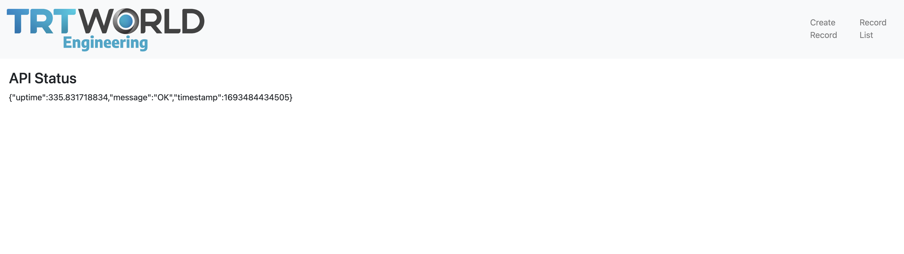

# Mern Stack project

cd mern-project

## Acceptance Criteria:

1. MongoDB should connected
2. All endpoints should work
3. All pages should work

# Python project

cd python-project

## Acceptance Criteria:

1. ETL.py file should run every 1 hour
